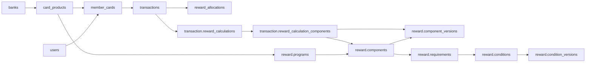
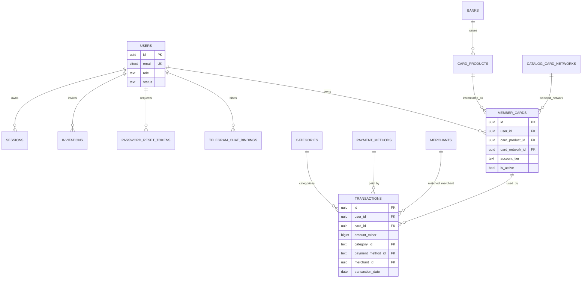
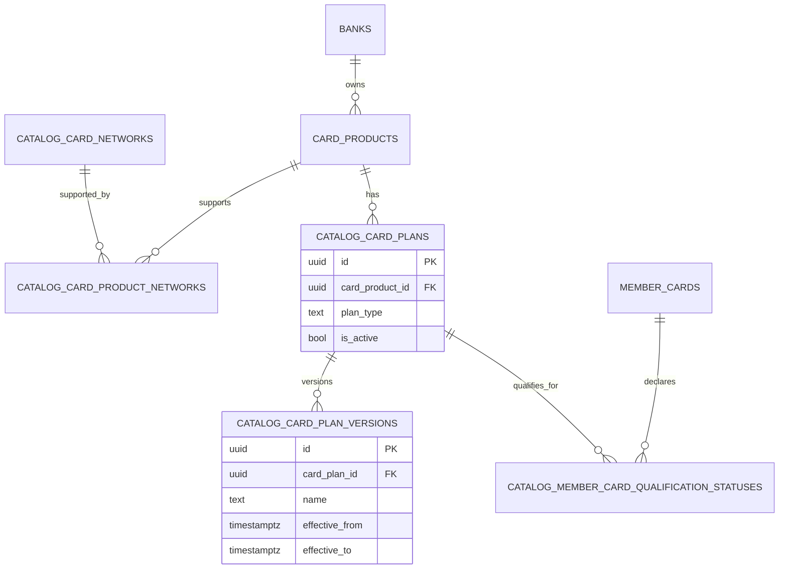
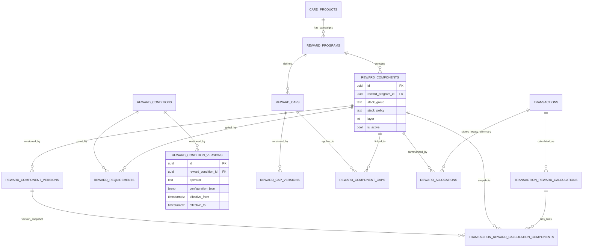

# Database Schema Guide

本文給剛接手後端的工程師快速理解目前資料庫結構、table 關聯、主要資料流，以及後續可優化方向。

Schema 來源以 [`sql/initial.sql`](../sql/initial.sql) 為準；程式使用位置以 `internal/repositories` 內的 SQL 為輔助。本文描述的是目前 snapshot 狀態，不是 migration 演進歷史。

## 1. 整體分區

目前資料庫雖然大多核心表仍在 `public` schema，但已經開始把較新領域拆到具名 schema。

| Schema | 職責 | 主要資料 |
| --- | --- | --- |
| `public` | 帳號、卡片主檔、交易主檔、基礎 lookup、舊版或共用表 | `users`, `member_cards`, `transactions`, `banks`, `card_products`, `categories`, `payment_methods`, `reward_units` |
| `catalog` | 卡片目錄的延伸模型 | 卡組織、卡片方案、方案版本、會員資格狀態 |
| `reward` | 回饋方案規則引擎模型 | 回饋活動、回饋元件、版本、條件、上限 |
| `member_profile` | 會員偏好與個人化設定 | 可用支付方式、回饋用量人工調整 |
| `transaction` | 回饋計算結果 snapshot | 計算批次、每個元件的計算明細 |
| `integration` | 整合事件 | outbox event |

另外 `identity`、`merchant`、`recommendation` schema 已建立但目前沒有 table，像是預留給後續 bounded context 拆分使用。

高層資料流：

## 2. 核心 ERD

### 帳號、會員卡、交易

### 卡片目錄、方案與會員資格

### 回饋規則與計算結果

## 3. Table-by-table 說明

### Identity / Auth

| Table | 用途 | 重要關聯與限制 | 後端使用位置 |
| --- | --- | --- | --- |
| `users` | 系統使用者，支援 `admin` 與 `member` | `email` 使用 `citext` unique；`role/status` 有 check constraint | 登入、驗證、邀請、重設密碼、會員資料 |
| `sessions` | 登入 session | `user_id -> users(id)` cascade；`token_hash` unique | `public/login.go`, `public/authenticate.go`, `public/logout.go` |
| `invitations` | 管理員邀請會員 | `invited_by -> users(id)`；`token_hash` unique | `public/create_invitation.go`, `public/accept_invitation.go`, `admin/invitations.go` |
| `password_reset_tokens` | 密碼重設 token | `user_id -> users(id)` cascade；`token_hash` unique | `public/request_password_reset.go`, `public/reset_password.go` |
| `telegram_chat_bindings` | Telegram chat 與會員一對一綁定 | `chat_id` PK；`user_id` unique + FK cascade | `admin/telegram_bindings.go`, `telegram/repository.go` |
| `schema_migrations` | migration 版本紀錄 | `version` PK | Docker init 與 `migrations.Apply` |

### Card Catalog

| Table | 用途 | 重要關聯與限制 | 後端使用位置 |
| --- | --- | --- | --- |
| `banks` | 發卡銀行 | `name` unique；`code` unique 但目前仍 nullable | `admin/banks.go`, `admin/card_products.go`, member lookup |
| `card_products` | 信用卡產品主檔 | `bank_id -> banks(id)`；同銀行卡名 unique；含 UI/資格描述欄位 | `admin/card_products.go`, `member/lookups.go`, `member/cards.go` |
| `catalog.card_networks` | 卡組織，如 Visa/Mastercard/JCB/Amex | `id` PK，`is_active` | card product network lookup、member card network |
| `catalog.card_product_networks` | 卡產品支援哪些卡組織 | `(card_product_id, card_network_id)` PK | `admin/card_products.go`, `member/lookups.go` |
| `catalog.card_plans` | 卡片方案/資格，例如 qualified/selectable | `card_product_id -> card_products(id)` cascade；`plan_type` check | `admin/card_products.go`, `admin/activities.go`, `member/reward_catalog.go` |
| `catalog.card_plan_versions` | 方案名稱、提醒文字、有效期間版本 | FK 到 `card_plans`；GiST exclusion 防同一 plan 期間重疊 | reward condition 展示與判斷 |
| `catalog.member_card_qualification_statuses` | 會員某張卡對某方案是否符合資格 | FK 到 `member_cards` 與 `card_plans`；GiST exclusion 防同一卡同方案期間重疊 | `member/reward_catalog.go`, `member/cards.go`, `member/transactions.go` |

補充：`member_cards` 上有 trigger `member_card_network_check`，會檢查使用者選的 `card_network_id` 必須存在於 `catalog.card_product_networks`，避免會員卡選到該產品不支援的卡組織。

### Lookup / Merchant

| Table | 用途 | 重要關聯與限制 | 後端使用位置 |
| --- | --- | --- | --- |
| `categories` | 消費類別 | `id` text PK；交易禁止使用 `general` | `admin/categories.go`, `member/lookups.go`, recommendation rules |
| `payment_methods` | 支付方式 | `id` text PK；`type` in physical/online/mobile/electronic_ticket | `admin/payment_methods.go`, `member/transactions.go`, `member/reward_catalog.go` |
| `merchants` | 標準店家 | `id` uuid PK；`name` unique；`is_system` 控制是否可刪 | `admin/merchants.go`, `member/lookups.go`, transaction create/update |
| `merchant_aliases` | 店家別名 | `(merchant_id, alias)` PK；merchant cascade | 管理員店家維護，用於別名展示/後續比對擴充 |
| `merchant_categories` | 店家與類別多對多 | `(merchant_id, category_id)` PK | `admin/merchants.go`, `member/lookups.go` |
| `reward_units` | 回饋單位與換算率 | `precision`、`symbol_position`、`twd_rate` check | `admin/reward_units.go`, member lookup/recommendation |

### Member Profile

| Table | 用途 | 重要關聯與限制 | 後端使用位置 |
| --- | --- | --- | --- |
| `member_cards` | 會員持有的卡 | `user_id -> users` cascade；`card_product_id -> card_products`；`card_network_id -> card_networks`；`(id,user_id)` unique 供交易複合 FK | `member/cards.go`, `member/transactions.go` |
| `reward_preferences` | 會員對不同回饋單位的偏好權重 | `(user_id, reward_unit_id)` PK；weight >= 0 | `member/preferences.go`, `member/transactions.go` |
| `member_profile.user_payment_methods` | 會員可用行動支付/電子票證 | `(user_id, payment_method_id)` unique | `member/reward_catalog.go`, `member/transactions.go`, `member/lookups.go` |
| `member_profile.reward_usage_adjustments` | 回饋用量人工調整 | FK 到 user/card/cap/reward unit；期間 check | schema 已建立，目前 repository 使用較少，可視為預留能力 |

### Reward Catalog

| Table | 用途 | 重要關聯與限制 | 後端使用位置 |
| --- | --- | --- | --- |
| `reward.programs` | 一張卡的一期回饋活動/權益包 | `card_product_id -> card_products`；`status` in draft/published/archived | `admin/activities.go`, `member/transactions.go`, `member/lookups.go` |
| `reward.components` | 活動中的單一回饋元件 | `reward_program_id -> reward.programs` cascade；含 stack/layer/priority | `admin/activities.go`, recommendation rule loading |
| `reward.component_versions` | 回饋元件的版本化內容 | FK 到 component/reward unit；GiST exclusion 防同 component 有效期間重疊 | admin reward version、transaction calculation snapshot |
| `reward.conditions` | 條件主檔，例如 category/payment_method/card_plan | `condition_type` check | `admin/activities.go`, rule loading |
| `reward.condition_versions` | 條件版本與 JSONB 設定 | `configuration_json` 儲存 `category_ids`、`payment_method_ids`、`merchant_ids`、`card_plan_ids` 等 | 大量 lateral `jsonb_array_elements_text` 解析 |
| `reward.requirements` | component 與 condition 的關聯 | component/condition FK cascade；有效期間 check | recommendation rule loading |
| `reward.caps` | 回饋上限主檔 | `reward_program_id -> reward.programs` cascade；scope check | `admin/activities.go`, recommendation cap |
| `reward.cap_versions` | 上限版本 | FK 到 cap/reward unit；GiST exclusion 防同 cap 期間重疊 | cap lookup |
| `reward.component_caps` | component 與 cap 多對多 | `(reward_component_id, reward_cap_id, effective_from)` PK | cap lookup |
| `reward.migration_reports` | migration 時留下的資料品質報告 | severity check | 目前偏資料遷移稽核用途 |

### Transaction / Calculation

| Table | 用途 | 重要關聯與限制 | 後端使用位置 |
| --- | --- | --- | --- |
| `transactions` | 會員交易主檔 | `user_id -> users` cascade；`(card_id,user_id) -> member_cards(id,user_id)`；category/payment/merchant/card network FK | `member/transactions.go` |
| `reward_allocations` | 舊/摘要型回饋配置結果 | `transaction_id -> transactions` cascade；`benefit_id -> reward.components`；交易 + component unique | 月用量、簡易列表、既有推薦結果 |
| `transaction.reward_calculations` | 一筆交易的一次完整計算批次 | `transaction_id -> transactions` cascade；同交易同時只有一筆 active partial unique index | `member/transactions.go`, `member/reward_catalog.go` |
| `transaction.reward_calculation_components` | 計算批次中的每個 component 明細 snapshot | FK 到 calculation、component、component version、reward unit、card plan、qualification status | 回饋明細與 audit snapshot |

### Integration

| Table | 用途 | 重要關聯與限制 | 後端使用位置 |
| --- | --- | --- | --- |
| `integration.outbox_events` | Outbox pattern 事件表 | partial index `published_at IS NULL` 用於待發布事件 | transaction recorded/reward calculated、reward version changes |

## 4. 主要資料流

### 4.1 登入與身份驗證

1. `public/login.go` 用 email 找 `users`，驗證密碼後寫入 `sessions`。
2. `public/authenticate.go` 用 `sessions.token_hash` join `users`，確認 session 未過期且 user active。
3. logout 直接刪除 `sessions`。
4. reset password 會更新 `users.password_hash`、標記 token used，並刪除該 user 的全部 sessions。

### 4.2 管理員維護卡片與活動

1. 銀行與卡片產品由 `banks`、`card_products` 管理。
2. 卡片支援的卡組織寫入 `catalog.card_product_networks`。
3. 卡片資格/方案寫入 `catalog.card_plans` 與 `catalog.card_plan_versions`。
4. 回饋活動寫入 `reward.programs`。
5. 每個回饋項目寫入 `reward.components` 與 `reward.component_versions`。
6. 條件透過 `reward.conditions`、`reward.condition_versions`、`reward.requirements` 表達。
7. 上限透過 `reward.caps`、`reward.cap_versions`、`reward.component_caps` 表達。

這段主要由 `internal/repositories/admin/activities.go` 與 `internal/repositories/admin/card_products.go` 操作。

### 4.3 會員持卡與個人化設定

1. 會員新增卡片時寫入 `member_cards`，卡片必須對應有效 `card_products`。
2. 若有選卡組織，trigger 會確認該卡產品支援此 network。
3. 會員支付方式偏好寫入 `member_profile.user_payment_methods`。
4. 會員回饋偏好權重寫入 `reward_preferences`。
5. 會員資格狀態寫入 `catalog.member_card_qualification_statuses`。

這段主要由 `internal/repositories/member/cards.go`、`member/preferences.go`、`member/reward_catalog.go` 操作。

### 4.4 推薦與交易建立

交易建立時，`member/transactions.go` 大致流程如下：

1. 載入會員指定卡 `member_cards` + `card_products`。
2. 載入該卡產品的 published `reward.programs`。
3. 載入 active `reward.components` 與當日有效的 `reward.component_versions`。
4. 從 `reward.requirements` 找條件，再解析 `reward.condition_versions.configuration_json`。
5. 讀取會員的 `reward_preferences`、`member_profile.user_payment_methods`、當月 `reward_allocations` usage。
6. 呼叫推薦引擎計算每個 component 的回饋。
7. 寫入 `transactions`。
8. 寫入 `reward_allocations` 作為摘要與月用量基礎。
9. 寫入 `transaction.reward_calculations` 與 `transaction.reward_calculation_components` 作為完整 snapshot。
10. 寫入 `integration.outbox_events`，目前會產生 `TransactionRecorded` 與 `RewardCalculated`。

更新交易時會先 supersede 原本 active calculation，再寫入新的 active calculation。刪除交易時，因為 FK cascade，對應 calculation 與 allocation 會一起刪除。

## 5. 重要限制與索引

### 時間版本防重疊

以下表使用 GiST exclusion constraint，避免同一 owner 的有效期間重疊：

- `catalog.card_plan_versions`
- `catalog.member_card_qualification_statuses`
- `reward.component_versions`
- `reward.condition_versions`
- `reward.cap_versions`

這代表新增版本時，要確保 `effective_from/effective_to` 不重疊；`admin/reward_versions.go` 也有應用層協助關閉前一版。

### 交易與會員卡一致性

`transactions` 同時有：

- `user_id -> users(id)`
- `(card_id, user_id) -> member_cards(id, user_id)`

第二個 FK 確保不能用別人的 `member_card` 建交易。這比單純 `card_id -> member_cards(id)` 更安全。

### 常用查詢索引

| Index | 用途 |
| --- | --- |
| `transactions_user_date_idx` | 會員交易列表、月用量查詢 |
| `transactions_user_card_date_idx` | 會員某卡交易查詢與月鎖定粒度 |
| `transactions_payment_method_idx` | 依支付方式查交易 |
| `transactions_merchant_id_idx` | 依店家查交易 |
| `member_cards_user_active_idx` | 會員可用卡片 |
| `card_products_bank_active_idx` | 管理員/會員卡片 lookup |
| `reward_calculation_active_uidx` | 確保單一交易同時只有一筆 active calculation |
| `outbox_unpublished_idx` | outbox publisher 找未發布事件 |

## 6. 架構觀察

### 新舊模型並存

目前存在兩套回饋結果：

- `reward_allocations`：較扁平，適合快速計算月用量、列表摘要。
- `transaction.reward_calculations` / `transaction.reward_calculation_components`：較完整，保留 input、condition、reminder、version snapshot。

這是合理的過渡設計，但長期需要決定哪一套是「唯一權威」。目前程式兩者都寫，月用量主要仍靠 `reward_allocations`。

### `condition_versions.configuration_json` 提供彈性，但查詢成本高

條件值都放在 JSONB，例如：

- `category_ids`
- `payment_method_ids`
- `merchant_ids`
- `card_network_ids`
- `card_plan_ids`
- `reminder_messages`

優點是新增 condition type 很快；缺點是：

- FK 無法直接約束 JSON 內的 id。
- 查詢大量使用 `jsonb_array_elements_text`，SQL 較複雜。
- 不容易針對特定 condition value 建一般 B-tree index。

### `public` schema 負擔偏大

目前 `public` 同時包含身份、catalog、transaction、lookup、legacy summary。後續如果團隊持續演進 bounded context，可以逐步把表移到更明確的 schema，例如：

- `identity.users/sessions/invitations`
- `catalog.banks/card_products/categories/payment_methods/reward_units`
- `merchant.merchants/merchant_aliases/merchant_categories`

但這會牽涉大量 SQL 與 repository 修改，應該分階段做。

## 7. 可優化建議

### 高優先級

1. 釐清 `reward_allocations` 與 `transaction.reward_calculation_components` 的權威邊界  
   目前兩者都保存計算結果。建議短期文件化：「月用量與舊列表使用 `reward_allocations`；audit 與完整明細使用 `transaction.*`」。中期可評估讓月用量改讀 calculation components，或建立物化/彙總表。

2. 補齊 versioned reward 查詢索引  
   推薦流程會頻繁用 `reward_program_id`、`reward_component_id`、`effective_from/effective_to` 查目前有效版本。可評估補：
   - `reward.components(reward_program_id, is_active)`
   - `reward.component_versions(reward_component_id, effective_from, effective_to)`
   - `reward.requirements(reward_component_id, effective_from, effective_to)`
   - `reward.condition_versions(reward_condition_id, effective_from, effective_to)`
   - `reward.component_caps(reward_component_id, effective_from, effective_to)`

3. 為 outbox 補 lifecycle  
   目前有 `integration.outbox_events` 與 unpublished index，但需要確認是否有 publisher/重試/錯誤欄位。若要正式使用，建議補 `attempt_count`、`last_error`、`locked_at` 或明確的 worker 設計。

### 中優先級

4. 命名一致化  
   schema 已從 `*_code` 改成 `*_id`，但部分 constraint 名仍保留 `*_code_fkey`，例如 `transactions_category_code_fkey`、`transactions_payment_method_code_fkey`。功能不受影響，但交接時容易混淆，可在未來 migration 中 rename constraint。

5. 評估 JSONB condition 正規化  
   若 category/payment/merchant/card_plan 條件查詢越來越多，可拆出 typed join table，例如 `reward.condition_categories`、`reward.condition_payment_methods`。保留 JSONB 當 snapshot 或彈性欄位也可以，但要避免所有查詢都靠 lateral parse。

6. Merchant alias 的實際匹配策略需要補齊  
   現在交易可以直接存 `merchant_id` 與 `merchant_name`，店家 alias 主要由 admin 維護。若未來要自動匹配，需要補 deterministic matching 規則、case normalization、可能的 trigram index。

7. `banks.code` nullable 但 unique  
   目前 schema 允許多筆 NULL。若 code 是正式識別碼，建議補 NOT NULL；若只是 optional display/integration code，文件要明確標註。

### 低優先級

8. 將 `public` 表逐步搬到 domain schema  
   這是乾淨度提升，不是功能 blocker。建議等回饋模型穩定後再做，避免同時改 schema 與業務邏輯。

9. 補 table/comment 或 database-level comment  
   PostgreSQL 可以用 `COMMENT ON TABLE/COLUMN` 讓 DB inspection 工具直接看到說明。這對接手很友善，但需要 migration 實作。

10. 補 seed data 管理策略  
   目前 initial snapshot 含 seed data。建議明確區分「系統必要 seed」與「demo/catalog seed」，避免測試、正式環境與本機 demo 的資料期待混在一起。

## 8. 快速定位：功能對應表

| 功能 | 主要表 |
| --- | --- |
| 登入/session | `users`, `sessions` |
| 邀請會員 | `invitations`, `users` |
| 密碼重設 | `password_reset_tokens`, `users`, `sessions` |
| Telegram 綁定 | `telegram_chat_bindings`, `users` |
| 卡片目錄 | `banks`, `card_products`, `catalog.card_networks`, `catalog.card_product_networks` |
| 會員持卡 | `member_cards`, `catalog.member_card_qualification_statuses` |
| 支付方式設定 | `payment_methods`, `member_profile.user_payment_methods` |
| 店家與類別 | `merchants`, `merchant_aliases`, `merchant_categories`, `categories` |
| 回饋活動 | `reward.programs`, `reward.components`, `reward.component_versions` |
| 回饋條件 | `reward.conditions`, `reward.condition_versions`, `reward.requirements` |
| 回饋上限 | `reward.caps`, `reward.cap_versions`, `reward.component_caps` |
| 交易 | `transactions` |
| 回饋計算摘要 | `reward_allocations` |
| 回饋計算完整 snapshot | `transaction.reward_calculations`, `transaction.reward_calculation_components` |
| 整合事件 | `integration.outbox_events` |
