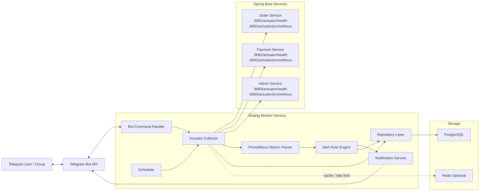
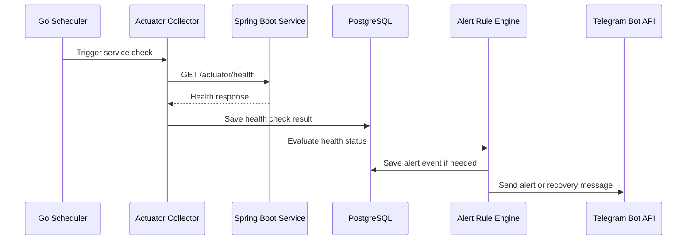
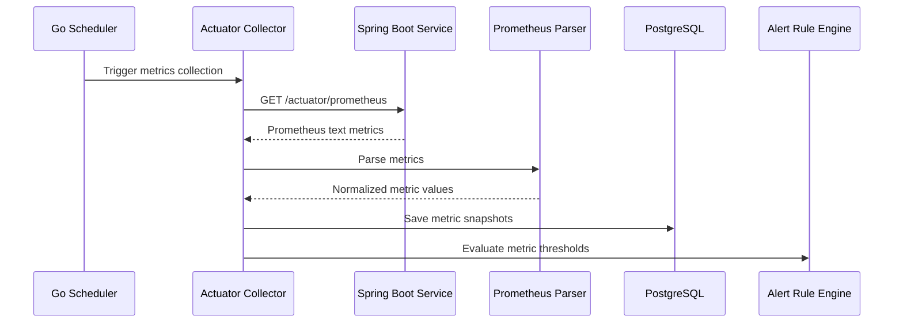
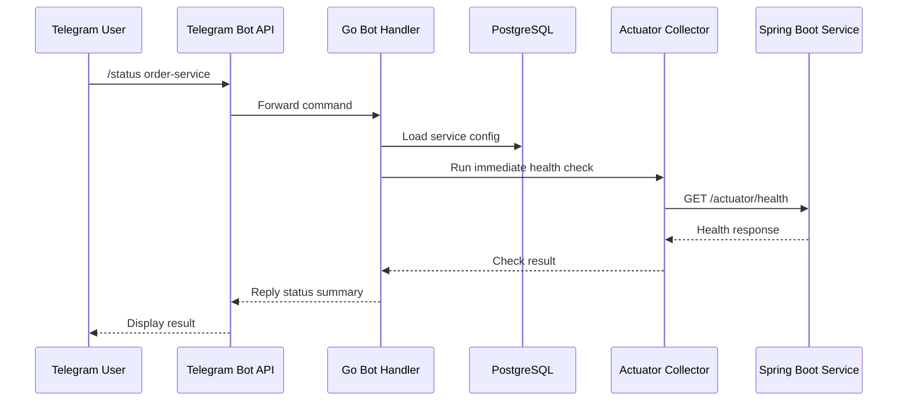

# Golang Spring Boot Monitor Bot - System Design

## 1. Project Overview

### 1.1 Project Name

`golang-springboot-monitor-bot`

### 1.2 Goal

Build a Golang-based monitoring and alerting system that monitors multiple Spring Boot services through Actuator endpoints and sends service-level alerts to Telegram.

The system is designed for an environment where multiple Java Spring Boot projects may run on the same host, but each service still needs to be monitored independently.

### 1.3 Main Use Case

Each Spring Boot service exposes:

```text
/actuator/health
/actuator/prometheus
```

The Golang monitor periodically checks these endpoints, stores health and metric data, evaluates alert rules, and sends Telegram notifications when a service becomes unhealthy or recovers.

## 2. Background

The company system is built with Java Spring Boot, while deployment is managed by MIS. The monitoring project should not require direct control over deployment infrastructure.

Instead, each Spring Boot service only needs to expose Actuator endpoints. The Golang monitor can be deployed separately on a personal computer, internal server, or container host, as long as it can access the service endpoints through the network.

## 3. Monitoring Scope

### 3.1 Service-Level Monitoring

This project focuses mainly on service-level metrics:

- Service health status
- API response time
- HTTP request count
- HTTP error rate
- JVM memory usage
- JVM thread count
- GC pause count and duration
- Database connection pool usage
- Process uptime
- Process CPU usage

### 3.2 Host-Level Monitoring

Host-level metrics such as machine CPU, RAM, disk, and network usage are not the main scope of the first version.

These can be added later through:

- Node Exporter
- OS agent
- SSH collector
- MIS-provided infrastructure monitoring

### 3.3 Why Service-Level Metrics Matter

If multiple Spring Boot projects are deployed on the same machine, host metrics alone cannot clearly identify which service is slow, unhealthy, or consuming abnormal resources.

Spring Boot Actuator metrics allow each service to be monitored independently even when several services run on the same host.

## 4. High-Level Architecture



## 5. Data Flow

### 5.1 Scheduled Health Check Flow



### 5.2 Metrics Collection Flow



### 5.3 Manual Telegram Query Flow



## 6. Main Components

### 6.1 Bot Command Handler

Responsible for handling Telegram commands.

Example commands:

```text
/add_service order-service http://10.0.0.12:8081
/list_services
/status
/status order-service
/metrics order-service
/disable_service order-service
/enable_service order-service
/silence order-service 30m
/alerts
/report today
```

### 6.2 Scheduler

Responsible for periodically triggering health checks and metrics collection.

Responsibilities:

- Load enabled services from database
- Trigger checks based on check interval
- Prevent duplicate checks for the same service
- Support graceful shutdown

### 6.3 Actuator Collector

Responsible for calling Spring Boot Actuator endpoints.

Default endpoints:

```text
GET {base_url}/actuator/health
GET {base_url}/actuator/prometheus
```

Responsibilities:

- HTTP timeout control
- Retry with backoff
- Response time measurement
- Error normalization
- Health response parsing
- Prometheus endpoint fetching

### 6.4 Prometheus Metrics Parser

Responsible for parsing Prometheus text format into normalized metric records.

Important Spring Boot metrics:

```text
http_server_requests_seconds_count
http_server_requests_seconds_sum
http_server_requests_seconds_max
jvm_memory_used_bytes
jvm_memory_max_bytes
jvm_gc_pause_seconds_count
jvm_gc_pause_seconds_sum
jvm_threads_live_threads
hikaricp_connections_active
hikaricp_connections_pending
process_cpu_usage
process_uptime_seconds
```

### 6.5 Alert Rule Engine

Responsible for evaluating service health and metric thresholds.

MVP alert rules:

- Health status is not `UP`
- Health endpoint timeout
- Response time greater than 2 seconds
- JVM heap usage greater than 85%
- DB connection pending count greater than 0
- Process CPU usage greater than 80%
- Continuous failures greater than 3 checks

### 6.6 Notification Service

Responsible for sending Telegram messages.

Notification types:

- Alert
- Recovery
- Daily report
- Manual query response
- Silence confirmation

### 6.7 Repository Layer

Responsible for database access.

Main entities:

- Service
- Health check
- Metric snapshot
- Alert rule
- Alert event
- Silence rule

## 7. Database Design

### 7.1 services

Stores monitored service configuration.

```sql
CREATE TABLE services (
    id BIGSERIAL PRIMARY KEY,
    name VARCHAR(100) NOT NULL UNIQUE,
    environment VARCHAR(50) NOT NULL DEFAULT 'production',
    base_url TEXT NOT NULL,
    health_path VARCHAR(255) NOT NULL DEFAULT '/actuator/health',
    metrics_path VARCHAR(255) NOT NULL DEFAULT '/actuator/prometheus',
    check_interval_seconds INT NOT NULL DEFAULT 60,
    enabled BOOLEAN NOT NULL DEFAULT TRUE,
    created_at TIMESTAMPTZ NOT NULL DEFAULT NOW(),
    updated_at TIMESTAMPTZ NOT NULL DEFAULT NOW()
);
```

### 7.2 health_checks

Stores service health check history.

```sql
CREATE TABLE health_checks (
    id BIGSERIAL PRIMARY KEY,
    service_id BIGINT NOT NULL REFERENCES services(id),
    status VARCHAR(50) NOT NULL,
    http_status_code INT,
    response_time_ms INT NOT NULL,
    error_message TEXT,
    checked_at TIMESTAMPTZ NOT NULL DEFAULT NOW()
);

CREATE INDEX idx_health_checks_service_time
ON health_checks(service_id, checked_at DESC);
```

### 7.3 metric_snapshots

Stores collected metric values.

```sql
CREATE TABLE metric_snapshots (
    id BIGSERIAL PRIMARY KEY,
    service_id BIGINT NOT NULL REFERENCES services(id),
    metric_name VARCHAR(255) NOT NULL,
    labels_json JSONB,
    value DOUBLE PRECISION NOT NULL,
    collected_at TIMESTAMPTZ NOT NULL DEFAULT NOW()
);

CREATE INDEX idx_metric_snapshots_service_metric_time
ON metric_snapshots(service_id, metric_name, collected_at DESC);
```

### 7.4 alert_rules

Stores alert threshold settings.

```sql
CREATE TABLE alert_rules (
    id BIGSERIAL PRIMARY KEY,
    service_id BIGINT REFERENCES services(id),
    metric_name VARCHAR(255) NOT NULL,
    operator VARCHAR(20) NOT NULL,
    threshold DOUBLE PRECISION NOT NULL,
    duration_seconds INT NOT NULL DEFAULT 0,
    severity VARCHAR(20) NOT NULL DEFAULT 'warning',
    enabled BOOLEAN NOT NULL DEFAULT TRUE,
    created_at TIMESTAMPTZ NOT NULL DEFAULT NOW(),
    updated_at TIMESTAMPTZ NOT NULL DEFAULT NOW()
);
```

### 7.5 alert_events

Stores alert lifecycle records.

```sql
CREATE TABLE alert_events (
    id BIGSERIAL PRIMARY KEY,
    service_id BIGINT NOT NULL REFERENCES services(id),
    rule_id BIGINT REFERENCES alert_rules(id),
    severity VARCHAR(20) NOT NULL,
    status VARCHAR(20) NOT NULL,
    message TEXT NOT NULL,
    started_at TIMESTAMPTZ NOT NULL DEFAULT NOW(),
    resolved_at TIMESTAMPTZ
);

CREATE INDEX idx_alert_events_service_status
ON alert_events(service_id, status);
```

### 7.6 alert_silences

Stores temporary alert silence settings.

```sql
CREATE TABLE alert_silences (
    id BIGSERIAL PRIMARY KEY,
    service_id BIGINT NOT NULL REFERENCES services(id),
    reason TEXT,
    starts_at TIMESTAMPTZ NOT NULL DEFAULT NOW(),
    ends_at TIMESTAMPTZ NOT NULL,
    created_at TIMESTAMPTZ NOT NULL DEFAULT NOW()
);
```

## 8. Telegram Command Design

### 8.1 Service Management

```text
/add_service <name> <base_url>
/remove_service <name>
/enable_service <name>
/disable_service <name>
/list_services
```

Example:

```text
/add_service order-service http://10.0.0.12:8081
```

### 8.2 Status Query

```text
/status
/status <service_name>
```

Example response:

```text
Service: order-service
Status: UP
Response Time: 132ms
Last Check: 2026-06-04 15:30:00
```

### 8.3 Metrics Query

```text
/metrics <service_name>
```

Example response:

```text
Service: order-service
JVM Heap Used: 63%
Live Threads: 92
DB Active Connections: 8
DB Pending Connections: 0
Process CPU: 23%
Uptime: 4d 3h 12m
```

### 8.4 Alert Management

```text
/alerts
/silence <service_name> <duration>
/unsilence <service_name>
```

Example:

```text
/silence order-service 30m
```

## 9. Alert Message Design

### 9.1 Down Alert

```text
[ALERT] order-service health DOWN

Environment: production
URL: http://10.0.0.12:8081
Reason: actuator health is DOWN
Response Time: 3200ms
Checked At: 2026-06-04 15:30:00
```

### 9.2 High JVM Memory Alert

```text
[ALERT] order-service JVM heap usage high

Environment: production
Heap Usage: 88%
Threshold: 85%
Checked At: 2026-06-04 15:30:00
```

### 9.3 Recovery Alert

```text
[RECOVERY] order-service is healthy again

Environment: production
Downtime: 4m 30s
Checked At: 2026-06-04 15:35:00
```

## 10. Spring Boot Configuration

### 10.1 Maven Dependencies

```xml
<dependency>
    <groupId>org.springframework.boot</groupId>
    <artifactId>spring-boot-starter-actuator</artifactId>
</dependency>

<dependency>
    <groupId>io.micrometer</groupId>
    <artifactId>micrometer-registry-prometheus</artifactId>
</dependency>
```

### 10.2 application.yml

```yaml
management:
  endpoints:
    web:
      exposure:
        include: health,info,metrics,prometheus
  endpoint:
    health:
      show-details: when_authorized
```

### 10.3 Security Recommendation

Actuator endpoints should not be publicly exposed.

Recommended protection:

- Internal network only
- VPN only
- Fixed IP allowlist
- Basic Auth
- Reverse proxy authentication
- Separate management port

Example:

```yaml
management:
  server:
    port: 9001
```

Then the monitor can use:

```text
http://service-host:9001/actuator/health
http://service-host:9001/actuator/prometheus
```

## 11. Golang Project Structure

```text
golang-springboot-monitor-bot/
├── cmd/
│   └── monitor/
│       └── main.go
├── internal/
│   ├── config/
│   ├── bot/
│   ├── scheduler/
│   ├── collector/
│   ├── parser/
│   ├── alert/
│   ├── service/
│   ├── repository/
│   └── model/
├── migrations/
├── deployments/
│   └── docker-compose.yml
├── demo/
│   └── springboot-service/
├── docs/
│   └── architecture.md
├── go.mod
└── README.md
```

## 12. Suggested Tech Stack

### 12.1 Backend

- Go
- net/http or Resty
- Telegram Bot API client
- PostgreSQL
- Redis optional
- Prometheus text parser
- Zap or Zerolog
- Docker Compose

### 12.2 Testing

- Unit tests for parser and alert rules
- Integration tests for collector
- Mock Spring Boot Actuator responses
- Testcontainers optional

### 12.3 Observability

The monitor itself should expose metrics in the future:

```text
/metrics
/healthz
```

Example monitor metrics:

```text
monitor_check_total
monitor_check_failed_total
monitor_alert_sent_total
monitor_collector_duration_seconds
```

## 13. MVP Scope

### Phase 1: Basic Health Monitoring

Features:

- Add service configuration
- List monitored services
- Periodically call `/actuator/health`
- Store health check history
- Send Telegram down alert
- Send Telegram recovery alert
- Support `/status`

Telegram commands:

```text
/add_service
/list_services
/status
/enable_service
/disable_service
```

### Phase 2: Prometheus Metrics Collection

Features:

- Call `/actuator/prometheus`
- Parse JVM memory metrics
- Parse DB connection pool metrics
- Parse process CPU metrics
- Store metric snapshots
- Support `/metrics`

### Phase 3: Alert Rules

Features:

- JVM heap threshold alert
- DB connection pending alert
- Process CPU threshold alert
- Consecutive failure alert
- Alert recovery detection
- Silence alert by duration

### Phase 4: Portfolio Enhancement

Features:

- Demo Spring Boot service
- Docker Compose setup
- README with architecture diagram
- CI workflow
- Unit tests
- Integration tests
- Example Telegram screenshots
- API documentation

## 14. Risk and Considerations

### 14.1 Security Risk

Actuator endpoints may expose sensitive application details.

Mitigation:

- Expose only required endpoints
- Restrict network access
- Use authentication
- Avoid exposing environment variables or config values

### 14.2 Network Access

The Golang monitor must be able to reach internal company services.

Mitigation:

- Run monitor inside company network
- Use VPN
- Use fixed IP allowlist

### 14.3 Alert Noise

Too many alerts can make notifications useless.

Mitigation:

- Consecutive failure threshold
- Recovery notification
- Silence support
- Alert deduplication

### 14.4 Data Volume

Metric snapshots may grow quickly.

Mitigation:

- Store only selected metrics
- Add data retention policy
- Aggregate old data
- Delete raw snapshots after a fixed period

## 15. Future Extensions

- Web dashboard
- Prometheus-compatible exporter
- Grafana dashboard
- Slack / Discord alert support
- Multi-tenant organization support
- Service dependency map
- Incident timeline
- SLO and uptime report
- Node Exporter integration for host metrics
- Kubernetes service discovery

## 16. Summary

This project is a backend-focused Golang monitoring system designed to monitor Java Spring Boot services independently through Actuator endpoints.

It demonstrates practical backend engineering skills:

- HTTP integration
- Scheduling
- Metrics collection
- Prometheus text parsing
- Database design
- Alert rule evaluation
- Telegram Bot integration
- Service-level observability
- Docker-based deployment
- Production-oriented security considerations

The project is suitable as a backend portfolio project for Golang roles in Taiwan, especially roles related to SaaS platforms, FinTech, DevOps tools, cloud-native systems, and high-availability backend services.
