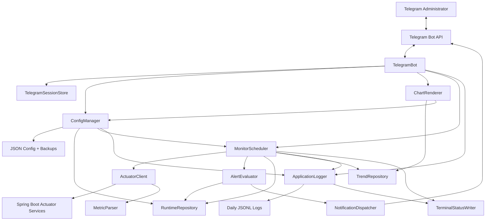
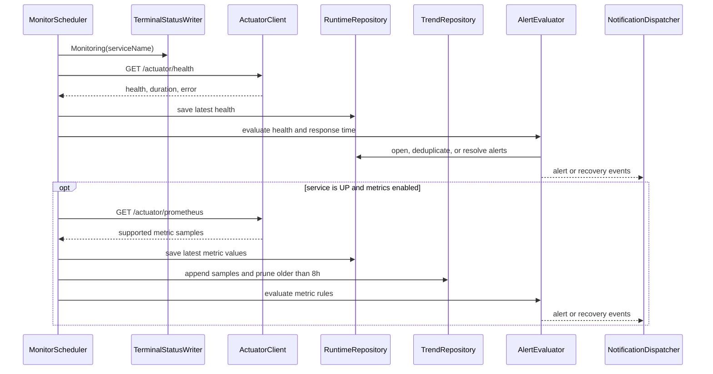
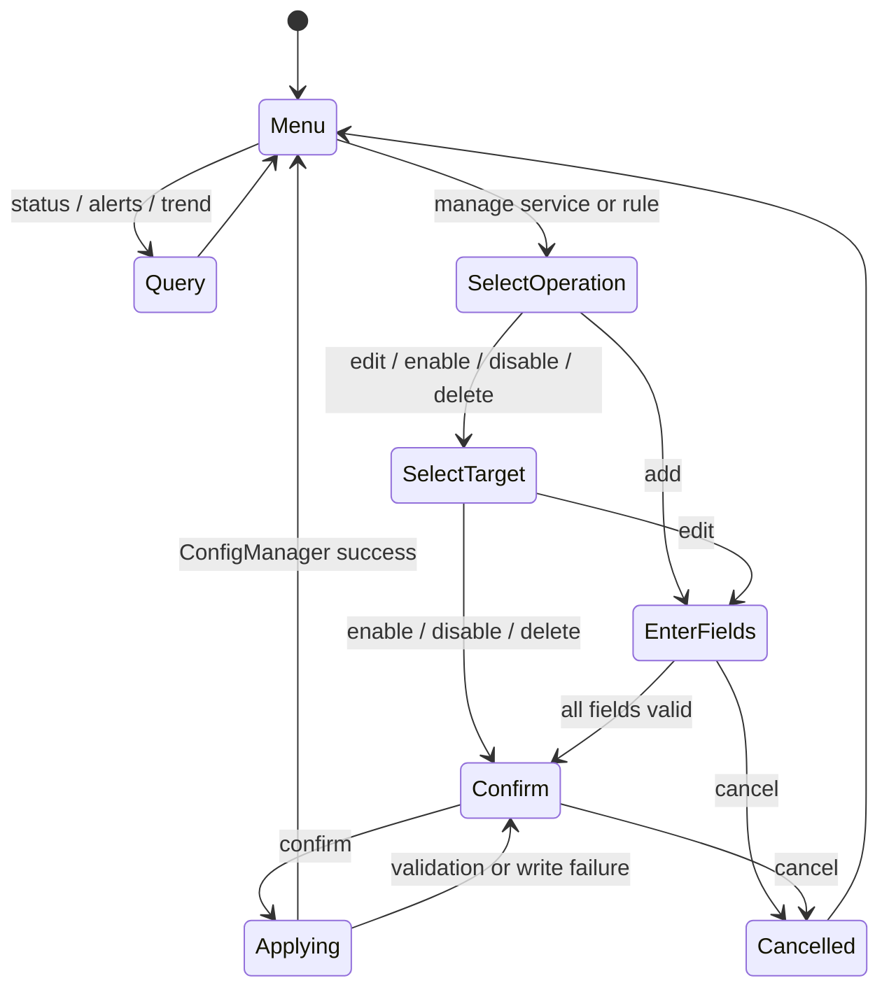
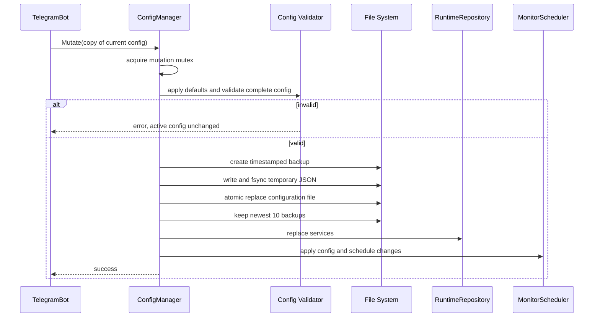
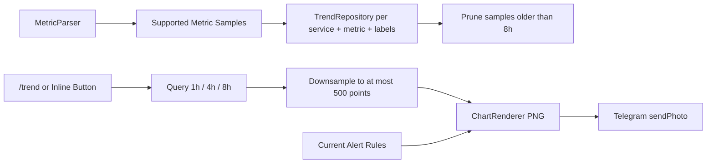
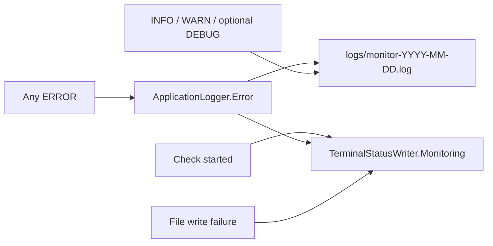

# Golang Spring Boot Monitor Bot Detailed System Design

## 1. Goals And Constraints

This single-process Go application monitors fewer than ten Spring Boot Actuator
services. JSON is the only persistent configuration source. Runtime health,
alerts, Telegram sessions, and eight-hour metric trends are memory-only.

The Telegram bot is the primary management interface. Only one configured
administrator `chat_id` may query or mutate data. The system supports alert
acknowledgement, but contains no mute, unmute, silence, suppression, or related
state.

## 2. Component Architecture



## 3. Monitoring And Alert Flow



Each service check has an independent HTTP timeout and in-flight guard. A slow
or failed service never blocks another service. Alert deduplication keys are
`service_name + rule_key`. Recovery closes the open alert and sends one
recovery notification. Acknowledgement records who and when, but does not stop
evaluation, notification, or recovery.

## 4. Telegram Interaction

Supported commands:

```text
/menu
/list_services
/status
/status <service_name>
/metric <service_name>
/alerts
/check [service_name]
/trend <service_name> <metric_name> <1h|4h|8h>
```

Main menu buttons:

- Service status
- Current alerts
- Trend charts
- Service management
- Alert rule management
- Check now

Metric and trend queries use layered Inline Keyboard selection. Trend selection
is: service, first metric-name segment, second metric-name segment, exact metric
name, then 1h, 4h, or 8h.



Every Telegram update is rejected before dispatch unless its `chat_id` exactly
matches the configured administrator. Mutation workflows use a per-chat
`TelegramSession`, collect fields one at a time, show a redacted summary, and
require an explicit confirm callback. Sensitive configuration values are never
displayed or editable through Telegram.

## 5. Configuration Hot Update



`ConfigManager` serializes mutations with a mutex. It validates the complete
candidate using the same rules as startup. Failure before atomic replacement
leaves both active memory and the original JSON untouched. Backups use
`<config>.backup-<timestamp>` and only the newest ten are retained.

## 6. Trend Collection And Chart Flow



The in-memory trend key includes service, metric name, and a canonical sorted
label set. Trend charts preserve every label series and draw each series as a
separate line with its labels shown in the legend. Empty queries return a
reason and do not generate a blank image. Charts show service,
metric, time range, unit, and applicable thresholds. Restarting clears trends.

Supported JVM thread metrics include live, daemon, peak, cumulative started,
and state-classified thread counts. CPU metrics include process CPU usage,
system CPU usage, and system CPU core count.

## 7. Logging



Terminal output is restricted to:

```text
監控 order-server 中
ERROR 2026-06-11T14:30:25+08:00 order-server health check timeout
```

`ApplicationLogger` writes JSON Lines using the configured timezone. It rotates
daily, cleans files older than `retention_days` at startup and after rotation,
and uses owner-only file permissions where supported. `Error` writes to the
file and delegates to `TerminalStatusWriter.Error`; other levels never write to
stdout/stderr. File failures are reported to terminal and never stop monitors.

All fields pass through a redactor. Keys or values representing bot tokens,
bearer tokens, authorization headers, Actuator credentials, and full Telegram
updates are removed or replaced with `[REDACTED]`.

## 8. Data Models

```go
type AppConfig struct {
    App AppSettings
    Telegram TelegramConfig
    CronResultNotify CronResultNotifyConfig
    Logging LogConfig
    Services []ServiceConfig
    AlertRules []AlertRule
}

type ServiceConfig struct {
    Name, Environment, BaseURL, HealthPath, MetricsPath string
    CheckIntervalSeconds int
    Enabled bool
}

type AlertRule struct {
    Key, ServiceName, MetricName, Operator, Severity, Message string
    Labels map[string]string
    Threshold float64
    Enabled bool
}

type ServiceRuntimeState struct {
    LastHealth *HealthCheck
    LatestMetrics []MetricSample
}

type AlertState struct {
    ID int64
    ServiceName, RuleKey, Severity, Status, Message string
    OpenedAt, LastTriggeredAt time.Time
    RecoveredAt, AcknowledgedAt *time.Time
    AcknowledgedBy string
}

type MetricSample struct {
    ServiceName, MetricName string
    Labels map[string]string
    Value float64
    CollectedAt time.Time
}

type TelegramSession struct {
    ChatID, Operation, Step string
    Values map[string]string
    ExpiresAt time.Time
}

type ConfigBackupMetadata struct {
    Path string
    CreatedAt time.Time
}

type LogConfig struct {
    Directory, Level, Timezone string
    RetentionDays int
}

type LogEvent struct {
    Time time.Time
    Level, Component, Service, Event, Message string
    Fields map[string]any
}
```

`AlertState` deliberately has no mute-related field.

## 9. Configuration Schema

```json
{
  "logging": {
    "directory": "logs",
    "level": "info",
    "retention_days": 14,
    "timezone": "Asia/Taipei"
  }
}
```

The service and alert rule arrays remain in the existing JSON format.
`cron_result_notify` remains an optional notification channel. Actuator
authentication is not implemented.

## 10. Reliability And Security

- Use locks around configuration, runtime state, trends, and Telegram sessions.
- Reject unauthorized Telegram updates before parsing commands or callbacks.
- Never allow Telegram to read or modify secrets.
- Apply bounded exponential backoff for Telegram rate limits and transient
  failures.
- Use independent Actuator request timeouts and concurrent service checks.
- On shutdown, stop accepting work, wait for checks/config writes, and flush
  logs.
- Write audit events for every attempted and completed Telegram mutation.
- Create log files with permissions restricted to the execution account.

## 11. Test Plan

- Assert normal terminal output contains one `監控 <service> 中` line per check
  and no successful result, metric, Telegram, config, INFO, WARN, or DEBUG text.
- Assert every ERROR reaches terminal and the daily `.log`.
- Assert daily rotation, fourteen-day cleanup, redaction, and non-fatal file
  failures.
- Assert complete validation, backup creation, atomic replacement, retention of
  ten backups, immediate runtime update, and rollback on failure.
- Assert unauthorized chat IDs cannot query or mutate.
- Assert service/rule add, edit, enable, disable, delete, and confirmation.
- Assert alert open, deduplication, acknowledgement, and recovery.
- Assert every supported metric is retained for eight hours and can render 1h,
  4h, and 8h charts with at most 500 points.
- Search source, configuration, commands, callbacks, and models to ensure no
  mute, unmute, silence, or suppression behavior exists.

## 12. Graceful Shutdown

Signal cancellation stops Telegram polling and scheduler dispatch. The process
waits for active service checks and any configuration mutation to finish, then
flushes and closes the application logger. Runtime and trend memory may be
discarded.
